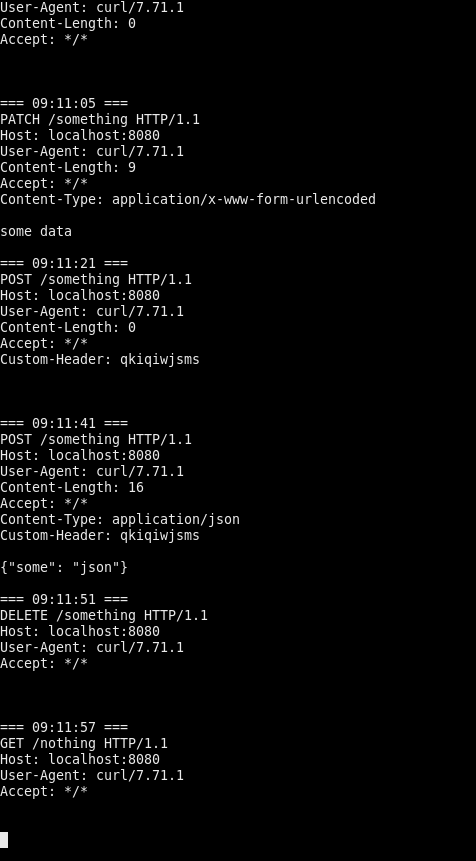

requestbin
==========

The most simple HTTP server thing that just logs all the requests it gets to the terminal, for debugging purposes. Also known as "requestbin", "postbin", "http logger" (actually none of these queries return anything, but maybe now they will return this).

## Install

```
go get github.com/fiatjaf/requestbin
```

Or grab a binary from the [releases](releases).

## Usage

```shell
requestbin -port 1234
```



## License

Public domain.
